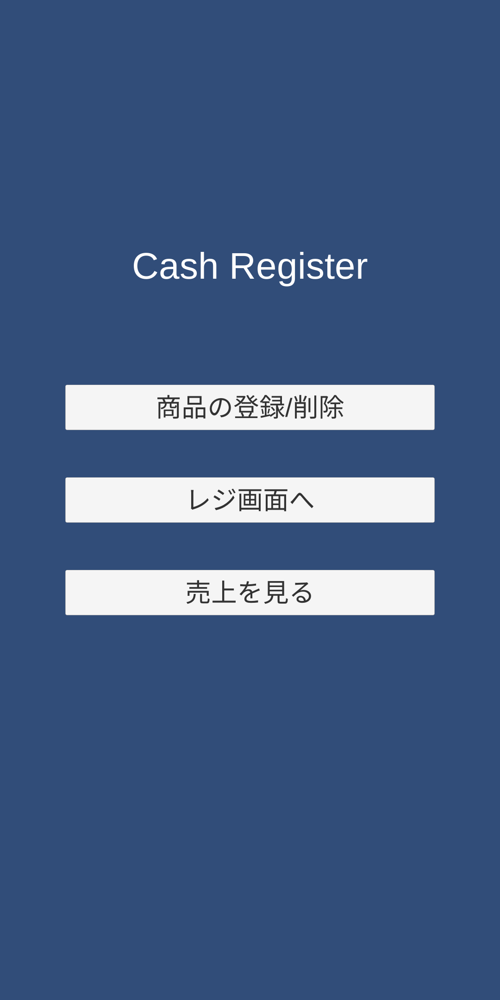
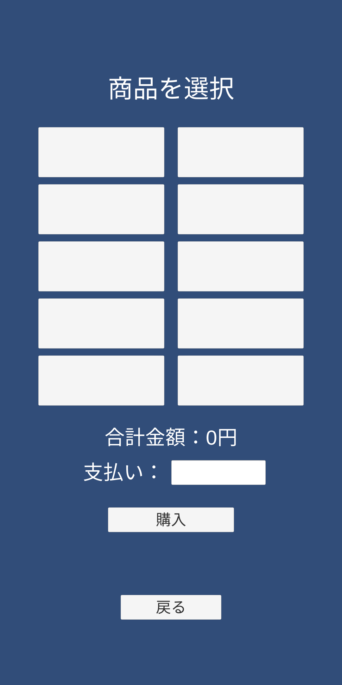

## はじめに

どーも（元）会長です。1つのプログラムができるまで、どんなことを考えてやってみればいいのかってなかなか想像が難しいです。今回は実際のアプリ開発中に考えたことなどを共有できればいいなと思ってます。

## きっかけ

学祭で屋台をやるので、その会計管理ができるアプリがあるといいなーなんて思ったので、Unityの勉強ついでにやってみた。

## 機能を考える

屋台で使う程度なので、とりあえず商品を登録して会計して、どんくらい売上が出たのかを見ることができればOKだろう。

## UIを考える

UI、つまり画面の見た目。幸いなことにUnityにはuGUIというものがあり実装にはそこまで困らなかった。あとはセンスの問題。

とりあえずメインの会計行うを画面と、商品の登録を行う画面と、売上を見られる画面の3つがあり、それらをホーム画面で行き来できれば良いだろう。と考えた

## UIを作る

先にも書いたがuGUIをふんだんに使う。主にButtonを用いていく。ButtonにはOnClick（押されたときに呼び出される関数）をスクリプトに書いて紐づけておけばすぐに使えるらしい。便利。商品は10個登録できればまあいいだろうと考えて、横2×縦5で配置。Prefab化してデザインは一括管理。便利。

  
  
  

## スクリプトを書く

長くなるので次回。
