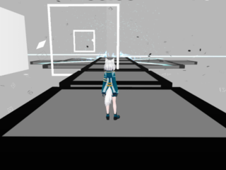
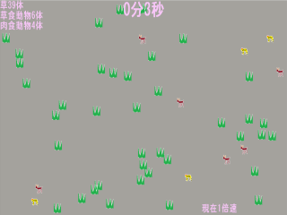

この記事では2019年度の宇都宮大学峰ヶ丘祭でCactusが発表したゲームを紹介します

また、記事の最後では紹介したゲームをDLできるURLを掲載しております!

ぜひ最後まで読んでみてください🌵

### ①くろねこのぼうけん

　くろねこのぼうけんは黒猫を操作して敵を避けながらゴールを目指す2Dスクロールアクションゲームです。難易度はスペースキーしか用いないという操作の簡単さもあり、そこそこ易しいと思います。

　今年、リメイクが出るという噂があるそうです……

### ②宇宙追盗譚

　宇宙追盗譚は宇宙船に乗った宇大のマスコットキャラクター、宇~太を操作して進む本格的シューティングゲームです。本格的過ぎて筆者はクリアできていません……　

　サークルに居る"その道の人"はラスボスまで到達していたので、シューティングゲームに自信があるぞ! という方にぜひ挑戦してもらいたいです。

### ③ミーシェの冒険

　ミーシェの冒険は移動&ジャンプでゴールを目指す3Dアクションゲームです。2019年度より、我々のサークルではUnityを用いたゲーム制作を始めており、こちらのゲームもそのUnityを使って制作したものの一つです。

　当時、1年生の学生が1人で制作したゲームでもあります……前途有望ですね!! すごい!!

### ④CIRCUIT TIME ATTACK

　CIRCUIT TIME ATTACKは3つのコースでタイムを競う3Dカートレースゲームです。

　こちらは初めてUnityに触れた１年生が、Unity公式で配布しているレーシングゲームのAssetを用いて作ったゲームになります。

　(使用したAsset:**Karting Microgame** /[https://learn.unity.com/project/karting-template](https://learn.unity.com/project/karting-template))

　たくさんの人々がAssetと呼ばれるプロジェクトの部品(のようなもの)を配布しており、これらを活用できるのもUnityの製作の良い点ですね。

### ⑤FOOD CHAIN

　FOOD CHAINは肉食動物、草食動物、草の数を設定し、どれだけ生態系が維持できるか試行するシミュレーションゲームです。

　画像の通りとてもシンプルなゲームなのですが、意外と奥が深く何回も遊んでみたくなるスルメ系ゲームです。生態系のバランスの難しさも学べます。

### ⑥びらくば

　びらくばは新入生を追いかけまわして50秒の間にどれだけビラを配れるか競うゲームです。

　暇になった春休みを犠牲にして制作しました。今年もこんなふうにビラを配りたかったですね……

　気になるゲームはありましたか?

　これらのゲーム以外にもCactus制作のゲームが入っているので、ぜひ遊んでみてくださいね!!

こちらからDL↓

[https://uucactus.com/2019/gakuSai/](https://uucactus.com/2019/gakuSai/)
