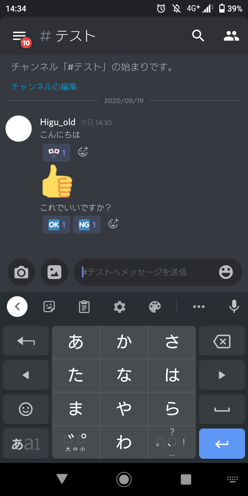

## はじめに

みなさんこんにちは。どうやら某国立大学が新歓でdiscordを使うみたいなので、先だってdiscordのメリットやら導入方法やら書こうかなと思います。

ちなみに弊サークルはサークル内のdiscordチャンネルがあります。つまり普段から使っている人が結構いるってことです。

## discordとは

Microsoft社の「Skype」はご存知でしょうか。それに似たもので、それより使いやすい通話サービスです。

ゲーマー向けチャットツール、なんて触れ込みでサービス開始したもののその使いやすさから多くの形態で使われています。

## discordを使うには

### アカウント作成までの流れ

必要なものは**メールアドレスだけ**。[こちら](https://discord.com/)にアクセスし、アプリをダウンロードし、なんやかんややっていればアカウントを作成し、使えるようになります。

### サーバーへの招待

discordはある一定のアカウントの集団を**「サーバー**」とし、その中にある**「チャンネル」**によって会話を行います。サーバーをLINEのグループ、そのグループ内の一定のメンバーの集まりをチャンネルと例えるとわかりやすいでしょうか。

サーバーへの招待は、サーバーにいる人から招待URLをもらうことで可能になります。アカウントを作成した人は、[こちら](https://discord.gg/tmrYZhAEMe)からサーバーの招待を受け取ってみてください（この目的のために作ったサーバーなので入っても何もありませんが）。

これでdiscordの基本的な使い方はOKです。

## チャットについて

discordのチャンネルには**「チャットチャンネル」「ボイスチャンネル」**の2種類に別れています。チャットチャンネルではチャットができ、ボイスチャンネルでは通話ができるということですね。

チャットチャンネルでのチャットでは以下のものを送信できます。

- 文字
- URL
- 画像などのファイル
- スタンプ

また、各人の発言にスタンプを押すことでアンケートのようなものを作成することもできたり、1人以上のメンバーに向けたメンションを送ることもできたりします。また、チャットチャンネルの会話内容は自分がサーバーに入る前のものも閲覧可能です。

## ボイスチャンネルについて

ボイスチャンネルの機能としては以下の通りです。

- 音声通話が基本
- カメラの起動が可能
- カメラの代わりに、画面キャプチャを通話画面に送ることが可能（画面共有）
- 通話をしながらチャットや別の作業を行うことができる

また、通話の参加方法ですが、自分が**通話をしたいチャンネルをタップ（クリック）するだけ**で大丈夫です。その時点で誰がチャンネルにいるのかがわかり、誰もいない場合は通話を1人で行うことになりますがマイクチェックやカメラのチェックには使えますし、とりあえず入っといて誰か来るのを待つという感じに使います。

## まとめ

いかがでしたか？正直discordはLINEより使いやすいツールで、「みんなが使ってるから」という理由がなければLINEなんて使ってないんですよね。サークルの新歓のみならずチャット・通話ツールとして相当使いやすいので、みなさんもぜひ使ってみてください。

## 結果

discordが使えるようになる！
