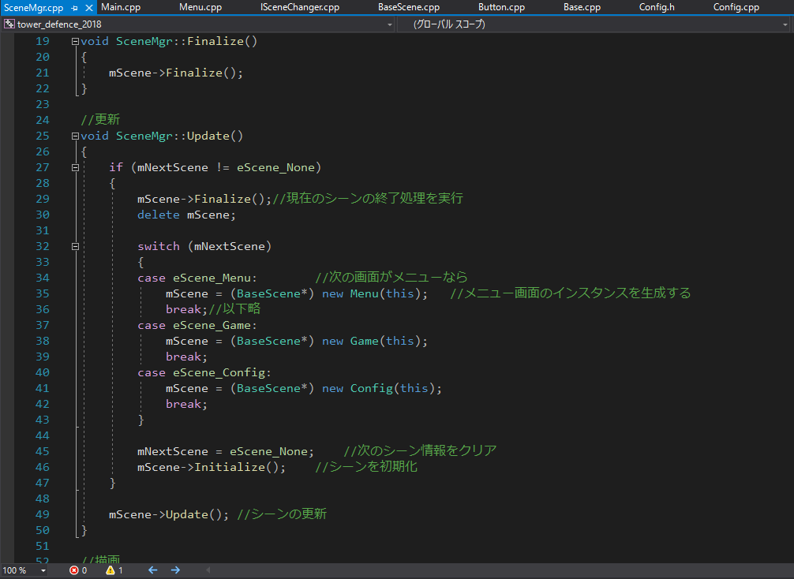

そろそろこの大学からいなくなるので、あったらいいな的な感じでVisual Studioの覚書でも書いておこうかと思いました。

## フォント

まず私のVisual Studioの画面を御覧ください。

<figure>



<figcaption>

ゲームっぽいやつ

</figcaption>

</figure>

フォントが違いますね。私は「Consolas」というフォントを使用しています。MSゴシックを使っている人は何やってもダメという研究結果はありませんが、いい感じのフォントを使うのはいい感じのプログラマーになるための条件となっているでしょう。フォントについての話は[フォントを考える話](https://uu-cactus.com/?p=81)でもしているのでぜひ読んでみてください。フリーでのプログラミング用フォントもありますよ。

  
フォントの変え方：ツール(T)→オプション→環境→フォント及び色


## ショートカットキー

「ショートカットキーを使いこなすと月収が334264円アップする」というおとぎ話も有名なように、ショートカットキーは作業を効率的にしてくれるものが多数存在します。今回はCtrl(Command)+CやAlt+F4のような有名なものではなくちょっと知ってたらドヤ顔できるショートカットキーを書いておきます。

#### Ctrl+F：検索 Ctrl+H：置換

まあまあ有名ですが書いておきます。これができるかできないかでマジで使い勝手が変わってきます。Ctrl+Fは他のソフト（ブラウザとか）でも使えるショートカットですのでバンバンCtrl+Fしまくりましょう。

#### Alt+↑，Alt＋↓：行の移動

カーソルがある行を上下に移動できます。例えば……

```
for (int i = 0; i < n; i++) {
	for (int j = 0; j < n; j++) {
	}
	function(i, j);
}
```

「あっ、functionの位置間違えちゃった」みたいな時。forやifを複数個使ってたりするとよくありますよね。そんな時、だいたいfunctionの行にカーソルがあるので、Alt+↑を押すと……

```
for (int i = 0; i < n; i++) {
	for (int j = 0; j < n; j++) {
		function(i, j);
	}
}
```

このように正しいところに持ってくることができます。これは、普段ならCtrl+Xで切り取ってCtrl+Vで貼り付けて、みたいなことをしないといけないのですがこれなら一瞬で終わります。めっちゃ便利です。

#### Ctrl+K の後 Ctrl+C：コメントアウト

選択した部分をコメントアウトします。

```
for (int i = 0; i < n; i++) {
	printf("%d:",i);
        for (int j = 0; j < n; j++) {
		function(i, j);
	}
}
```

特定の部分だけコメントアウトしたいな～と思ったとき、選択してCtrl+Kを押した後、Ctrl+Cをしてみましょう。(Ctrl+Kを押してないと、コピーになってしまいます)

```
for (int i = 0; i < n; i++) {
	printf("%d:",i);
      /*for (int j = 0; j < n; j++) {
		function(i, j);
	}*/
}
```

このように選択した部分をまとめてコメントアウトすることができます。

## まとめ

いかがでしたか？

ショートカットを知っているかどうかで作業効率が全然変わってくるはずです。

上に挙げた以外にもたくさんの便利な機能があるのでぜひ使ってみてください。
