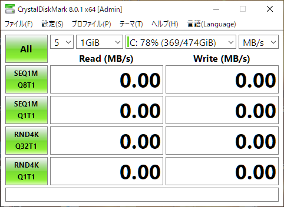
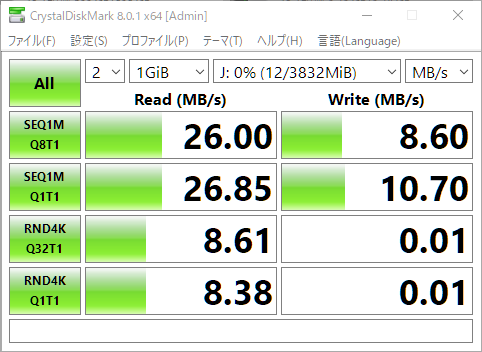

## まず最初に

皆さんUSBメモリを貰いませんでしたか？  
こんなやつです

ちょっとぼやけてますね（笑）  
これを受け取った時にふと思い立ったんです。  
「これはどんな性能のUSBなんだろう」  
そうと決まれば家に帰った後、さっそく調査してみることにしました。

## 使ったソフト

とりあえず調査するのは速度だけとします。  
そこで使ったソフトは以下の物です。

- CrystalDiskMark 8.0.1

以下のサイトからダウンロードできるので気になった方は試してみてください。

[https://crystalmark.info/ja/software/crystaldiskmark/](https://crystalmark.info/ja/software/crystaldiskmark/)

## 容量

まずは容量を調べてみましょう。  
エクスプローラーを開くと確認できます。

どうやら4GBのUSBメモリのようです。  
テキストなどの軽いものなら十分かもしれませんが、頼りない容量ですね。  
多くの学生に配る以上、コストの問題でこうなったのだと思いますが、性能を気にしなければ800円とかで32GBの物を買えることを考えると、せめて8GBにしてほしかったと思います。

## 速度

次に速度を調べてみましょう。  
条件として、貰った時点の容量で検証します（中にパンフレットなどが入っている状態）。  
まず、Crystal Disk Markを起動します。  
起動するとこのような画面になると思います。

今回は時間を余りかけないよう試行回数を2回に設定し、検証するドライブをUSBメモリに選択すると以下の様な画面になると思います（環境によってドライブレター（C:やD:）は変化します）。

設定出来たら、ALLボタンを押し、終わるまで待ちましょう。

### 結果

結果は以下のようになりました。

#### **シーケンシャルリード・ライト**

シーケンシャルリードとライト（上二つ）を見てみましょう。  
シーケンシャルリード・ライトが効いてくるのは、単一の動画といった大きなファイルの読み書きです。  
このUSBメモリの規格は2.0であり理論上60MB/s出ます。ですが、あくまでも理論上であり市販されている他のUSB2.0メモリと比べたら、読み込みに関してはたいして差があるような結果ではありません。  
しかし、書き込みは遅い部類に入るので、大きなファイルの書き込みはやめておきましょう。

#### **ランダムリード・ライト**

次に、ランダムリードとライト（下二つ）を見てみましょう。  
ランダムリード・ライトが効いてくるのは、連続してない細かいファイルの読み書きです。  
読み込みに関しては平均的な速度であると言えるでしょう。  
しかし、書き込みは酷い有様です。0.01MB/sしか出ておらずハッキリ言って遅いです。  
細かいファイルの多いものをこのUSBに保存しようとしてみてください。遅くてイライラするかもしれません。

実はUSBメモリの価格差に出てくるのはこういうところなのです。  
読み込みに関してはそこまで価格差に影響してきません。もちろん、違いはありますが。  
一番影響してくるのは書き込み速度であり、特にランダム性能に響いてきます。高いUSBメモリはそこが早いので快適に使用できるのです。

* * *

ランダム性能というのは結構大切で、パソコンの動作速度にも響いてきたりします。  
今や当たり前にOSが入っているドライブがSSDになっていますが、昔はHDDでした。  
HDDのパソコンを触った後にSSDのパソコンを触ると、起動速度など多くの速度が向上して感動すると思います。  
SSDはシーケンシャル速度もHDDに比べて早いですが、特に大きな違いはランダム性能にあります。  
HDDは円盤なので、ランダムにアクセスしようとすると遅くなるのは分かると思います。

* * *

### 性能が低いUSBの活用方法

今回検証したような、性能が低いUSBはランダム性能が低いことが多いです。しかし、ランダムは遅くとも、シーケンシャル性能はそこまで劣っていないことが分かります。  
したがって、ある程度大きなファイルなどはZIP圧縮等をして、単一のファイルにしてしまいましょう。単一のファイルであればシーケンシャル速度が効いてくるので、そこまで遅くなりません。  
ファイルを利用する時は、一度パソコンに移して展開すれば良いのです。  
これは性能の高いUSBメモリであっても、活用できるのでぜひ試してみてください。

## まとめ

今どきUSB2.0のメモリを渡してくる時点である程度察していたのですが、思っていたよりもランダム書き込みの性能が低くて驚きました。  
正直言って、USBメモリを多く使いそうな方はAmazonとかで別に買い足すことをお勧めします。

皆さんもぜひ手持ちのUSBメモリの速度を計ってみてはいかかでしょうか。
