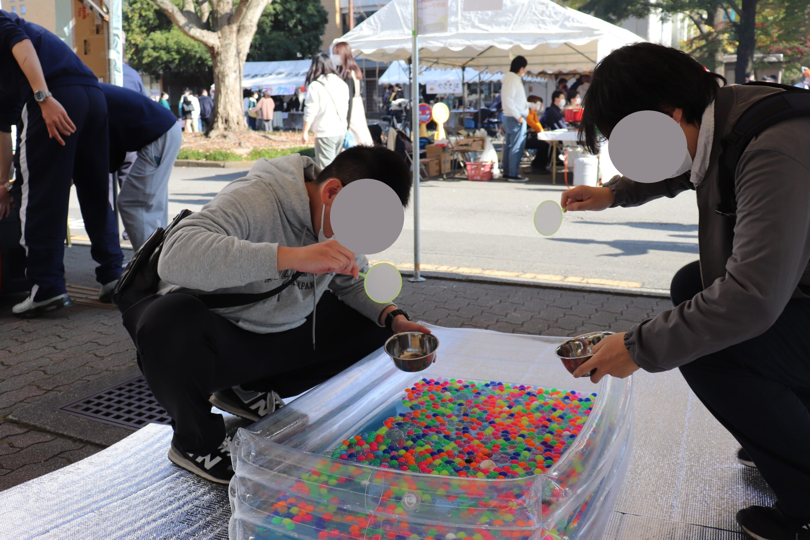

新年あけましておめでとうございます！！といいつつもう1月も終わろうとしていますね、すごく寒いですが元気にしてますか？

### 3年ぶりの学祭

2022年11月19，20日、宇都宮大学の学園祭**「峰が丘祭」**が3年ぶりに開催されました！我々情報研究会CACTUSでも例年通り出店を行いました！今回はそのレポートを書きたいと思います！

### 屋内展示

屋内展示では、例年通りCACTUSのメンバーで作成したゲームの展示を行いました。4号館の5Fということで人来るか心配でしたが、3年前よりもたくさんの方に来ていただきました！特にお子さんに好評だったのがうれしかったです。

<figure>

<figcaption>

高校生にも好評でした！

</figcaption>

</figure>

### 屋外展示

例年、CACTUSは屋外展示として出店を出しています。今までは飲食系屋台だったのですが、今年は縁日系屋台を出店しました。それもなんと**「スーパーボールすくい」**…

こちらもお子さんに好評でしたし、たくさんスーパーボールをすくってしまう方もいたので面白かったです！

### さいごに

ほとんどのメンバーにとっては初めての学祭でしたが、天気にも恵まれ花火やステージ発表も近くで観れたり、みんな楽しんでいたようでよかったです。来年も楽しみですね！

