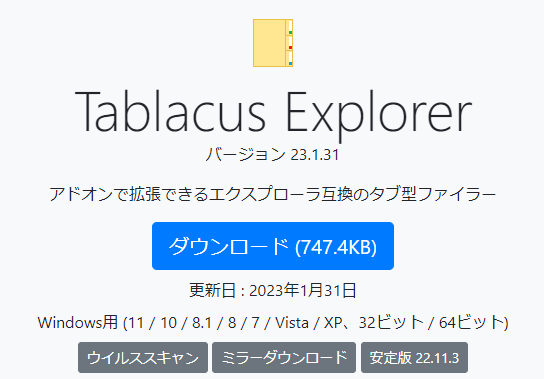
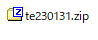
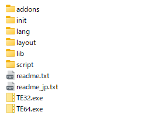
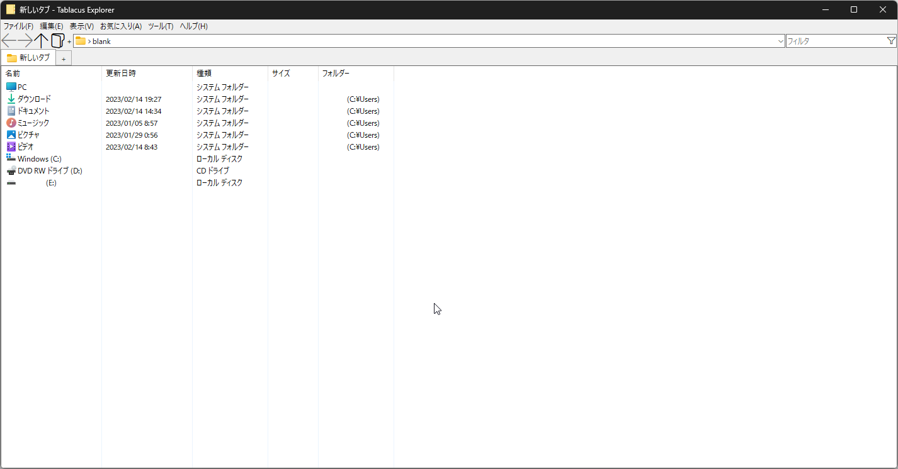
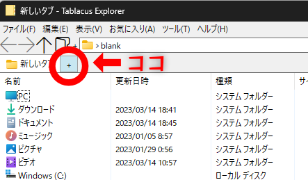
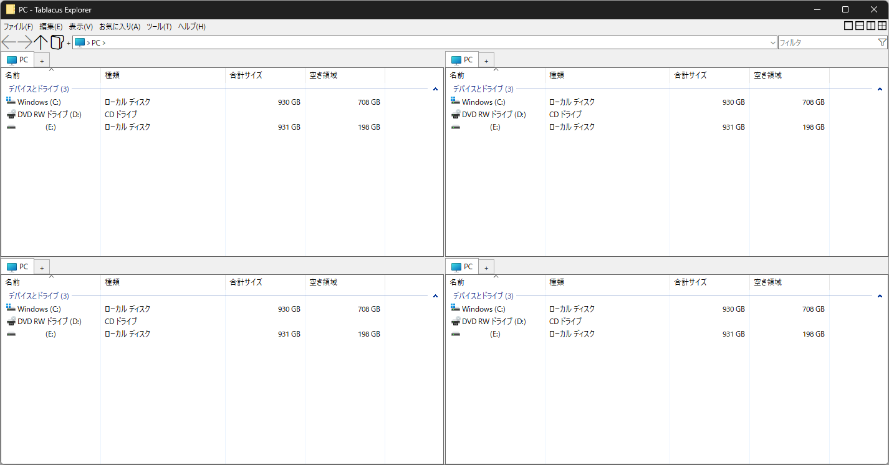
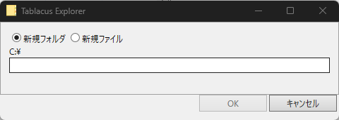
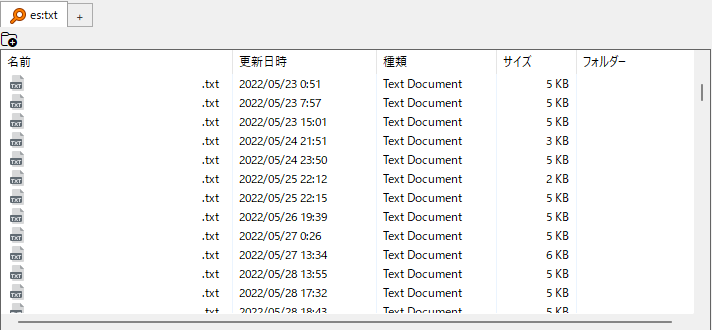
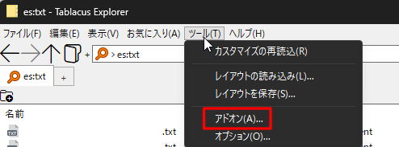
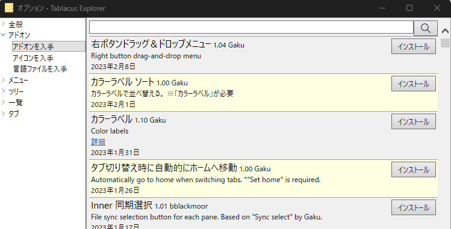

こんちゃす！CACTUS副会長です。

宇大生諸氏に関しましては後期成績も公開され、<ruby>悠々自適<rp>（</rp><rt>ゆうゆうじてき</rt><rp>）</rp></ruby>・<ruby>愉快適悦<rp>(</rp><rt>ゆかいてきえつ</rt><rp>)</rp></ruby>・<ruby>快活倶楽部<rp>(</rp><rt>かいかつくらぶ</rt><rp>)</rp>な春休みを送っていることでしょう。

  
さて、パソコンだいすきクラブのCACTUSメンバーに限らず、パソコンは大学生の必需品です。毎日のレポートやスライドの作成に欠かせない生命機関ライフラインとなってきたパソコンですが、そのパソコン、**十全に使えてますか？**

今回は、皆さんが使っているパソコンをより良くすべく、**Windows標準のエクスプローラーから脱却しよう**、という記事です。

## エクスプローラーって不便！

Windows標準のエクスプローラーって、ちょっぴり機能が限られてるんですよね。

- **検索機能が貧弱**  
    たかが1つのファイル検索に数分かかることも……
- **タブ機能なし**  
    フォルダ間のファイル移動に複数のウィンドウを開く必要があり、画面が大量のウィンドウに専有されて不便（Windows11 22H2アップデートで追加されたらしいけどそんなバージョン使ってる人はそうそういないね）

このちょっぴりの機能制限がどれだけの人々を苦しめてきたか……

## じゃあエクスプローラーの代替ソフト使おうぜ、っていう話

──代替ソフト？怪しくないの……？

怪しくないですよ。**Tablacus Explorer**っていうソフトです。

https://tablacus.github.io/explorer.html

11周年になる老舗ソフトなのですが、あんまり使ってる人が身近にいなかったので今回筆を執った次第です。

特徴としては

- **タブ型のファイルエクスプローラー**
- **アドオンが豊富で拡張性バツグン**
- **携行性◎**

あたりでしょうか。

## インストール方法

### 1\. 公式サイトからダウンロード

公式サイトの「ダウンロード」ボタンをクリックすると、zipファイルがダウンロードされます。

<figure>

<figcaption>

基本的に青いボタンでオッケーです

</figcaption>

</figure>

最新版はダウンロード数が少ないせいか、

こういう警告が出ることがあります（と言うか大体出ると思います）が、無視して三角矢印ボタンから「継続」を押してください。

<figure>

<figcaption>

気になる人は適宜ウイルススキャンを

</figcaption>

</figure>

### 2\. 解凍する

お好きな解凍ソフトを用いて、お好きなフォルダに解凍してください。

<figure>

<figcaption>

こうなる

</figcaption>

</figure>

解凍したら「TE64.exe」をクリックすれば、下のような画面になると思います。

これにてインストール終了！簡単ですね。

## Tablacus Explorerの特徴

先述の通り、Tablacus Explorerにはエクスプローラーにはない特徴があります。

### 特徴その① : タブ型のファイルエクスプローラー

Tablacus Explorerはその名の通り「タブ型のファイルエクスプローラー」です。普段皆さんが使っているウェブブラウザー（Google ChromeやSafariなど）と同じように、複数のタブ（ページ）を活用してファイル管理を効率的に行なうことが出来ます。

タブの追加は、下の赤丸部から+ボタンを押すだけ！（初めて+ボタンを押すと「デスクトップ」に移行すると思います）

複数タブでの作業は、もうエクスプローラーに戻れないほど快適ですよ……

### 特徴その② : **アドオンが豊富で拡張性バツグン**

アドオンってなに？って人のために……

> **機能拡張用のソフトウェアを合体させることで、本体となるソフトウェアのできることを増やせる機能のこと。**
> 
> [「分かりそう」で「分からない」でも「分かった」気になれるIT用語辞典](https://wa3.i-3-i.info/index.html)

要は、**「ソフトをもっと便利にする機能を追加できる！」** ということです。た、ただでさえタブ型で便利なのに……更に機能追加を……？

<figure>

<figcaption>

出典/鳥山明 「ドラゴンボール(26)」集英社(1991)

</figcaption>

</figure>

茶番は置いておいて……

例えば、画面を分割して表示できる「**分割**」、

<figure>

<figcaption>

画像は4分割ですが、6~12分割までサポートされています

</figcaption>

</figure>

右クリックせずに新規フォルダやファイルを作成できる「**Inner新規フォルダ**」、

<figure>

<figcaption>

コレが慣れると便利なんですわ

</figcaption>

</figure>

高度なファイル検索ソフトウェア「**Everything**」など（Everthingは独立したソフトウェアも存在します、詳細は余裕があれば別の記事で……）、

<figure>

<figcaption>

Windows標準の検索機能よりとっても高度です

</figcaption>

</figure>

この他にもたくさんのアドオンや、外観を変更できるテーマがありとっても拡張性が高いです！

アドオンの入れ方は簡単で、上部のメニューバーの「ツール」から「アドオン」へ進み……

「アドオンを入手」からほしい拡張機能をインストールして完了です！

### 特徴その③ : 携行性◎

Tablacus Explorerはインストールするタイプのソフトウェアではなく、解凍して起動するだけのソフトウェアです。  
なので、解凍したフォルダをUSB等の携帯できるメディアに入れると、自宅のデスクトップPCでも持ち運び用のノートPCでも同じ設定で使用することが出来ます！しかも**アドオンやテーマも引き継ぎできます！！**

## まとめ

いかがでしたか？

Tablacus Explorerで幸せなWindowsライフを送ってみてはいかがでしょうか？（雑な締め）
