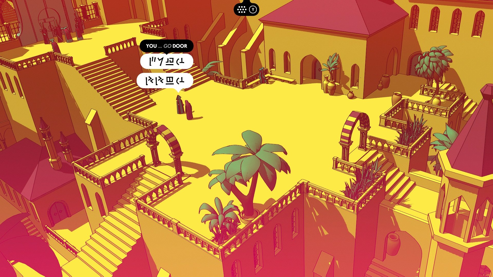
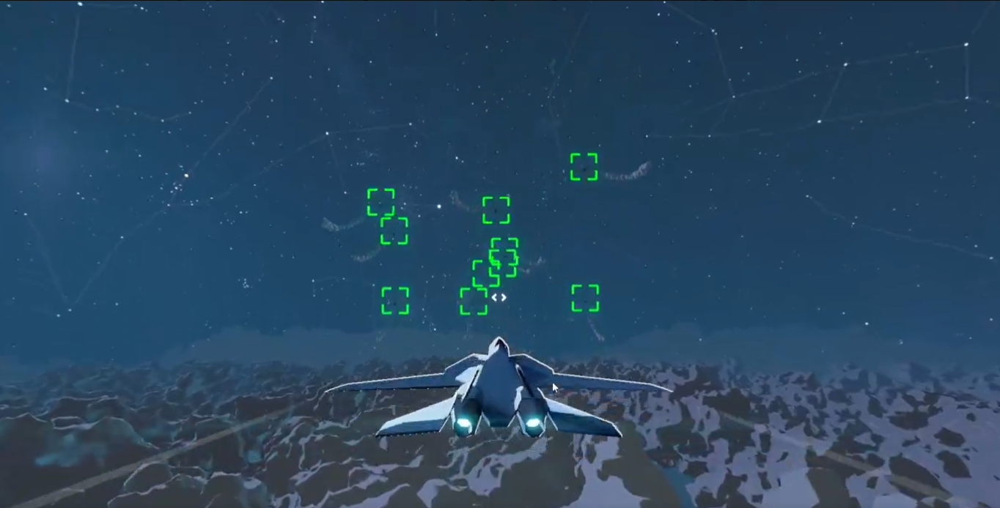

# ローポリなにそれおいしいの？

ローポリとは一般にポリゴン数すなわち面の数が少ない3Dモデルのことを言います。ロー(低い)ポリゴンということです。
これだけ聞くと、ローポリはただ品質の悪い3Dモデルとしか思えませんが、そうではありません。

ローポリのモデルは無駄に凝っておらず洗練されていて、それもまたデザイン性を感じさせるため、決して品質が低いようには見えません。

昔のファミコンのゲームなどは画質は悪く、ドット絵として表されていますが、あれはあれで良いと思えますよね。
マインクラフトなんかもそうです。ブロックひとつひとつを近くで見ると、カクカクしていてとても画質がいいとは言えません。そうは思わないという人も、マインクラフトを初めて見た人がどう思うか考えれば分かるはずです。

ローポリモデルは、ドット絵のような良さを感じさせてくれるのです。超美麗グラフィックであふれる現代でも、アンダーテールやマインクラフトなどが大ヒットしたことを例に出せば、皆さん納得していただけると思います。

早く実例を見せてくれよ、と思う人もいるかもしれません。では、ゲーム開発が好きな一般大学生の僕が良いと思った例を出してみましょう。

# たぶんローポリのゲーム

## 1. Chants of Senner

こちらのゲームは、未知の言語を解読していくゲームでとてもユニークなシステムです。ただ、今回はグラフィックに注目してみましょう。
まずは3Dモデル。これがまさにローポリです。独特な世界観にしっかりマッチしています。ローポリを活かすうえで大切なのはシェーダー、光の当たり方です。オレンジと茶色などのようにパキッとした色合いで、輪郭が際立っています。

## 2. DELIVERY MUST COMPLETE

同様の表現がこちらの海外(?)の方が開発中の戦闘機ローグライクでも見られます。こちらもパキッとした色合いですが、煙や雲の表現・炎の表現がよくマッチしています。

では、ローポリとよく組み合わせられるこのシェーダーの正体は何なのでしょうか。
このシェーダーは一般に「Toon Shader(トゥーンシェーダー)」と呼ばれます。トムとジェリーなどのアニメのことをカートゥーンといいますが、そのトゥーンです。

# シェーダーなにそれおいしいの？（再び）

このシェーダー、一体何をしているのかというと、反射した光の明るさを3〜5段階ほどに分けて、その明るさだけで立体感を表現しているのです。少し不正確な表現かもしれませんが、大まかにそういうことです。もちろん、輪郭はそれとは別の仕組みでつけていますが、細かいことはぜひ調べてみてください。

シェーダーという概念は、マインクラフトなどで聞かれたことがある方も多いとは思いますが、ゲームの雰囲気にとても大きな影響があり、興味深いものです。

ローポリの良さ、という本筋から外れた展開にはなりましたが、今回はここまで。
