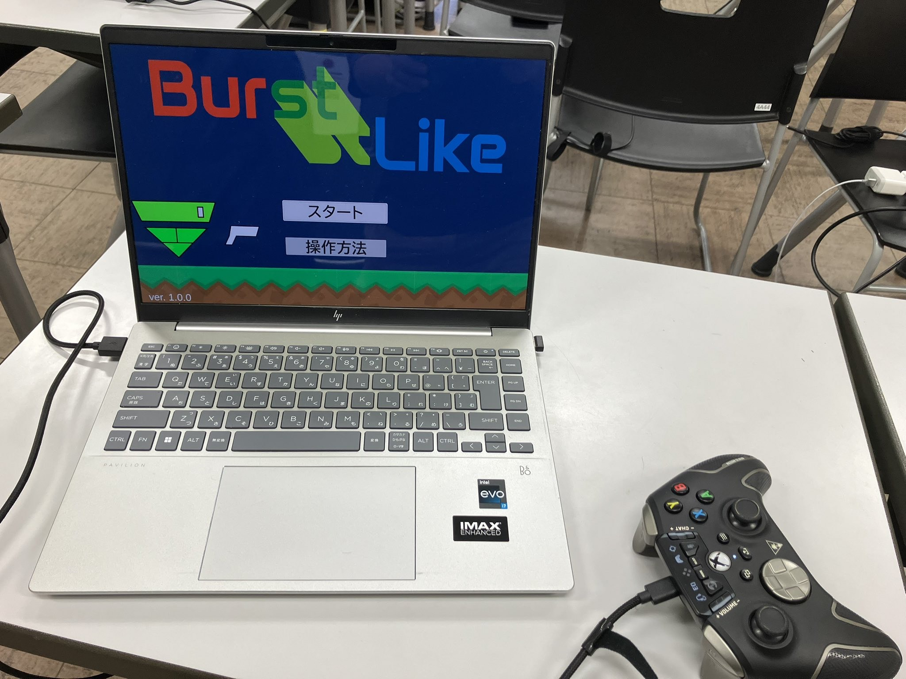
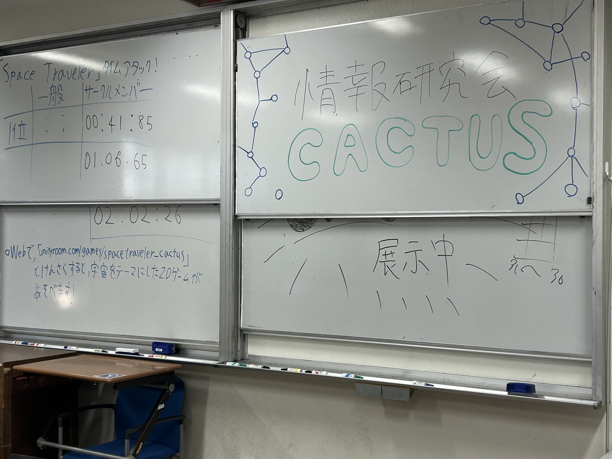

---
title: "第75回峰ヶ丘祭に参加しました！"
pubdate: 2025-12-07
authors: ["Muko"] 
category: "活動報告"
tags: ["学祭"] 
---

# はじめに
　こんにちは！令和7年度CACTUSの会長です！
本記事では、今年のCACTUSの学祭レポートを書いていきます！

# 当日の様子
　今回の学祭では例年通りゲーム展示を行いました！
開始した直後は誰も訪れなかったので不安でしたが、その後だんだんと人が増えてきてにぎわっていました！
作ったゲームにハマってくれている様子の人も多くみられてよかったです！

# Webで遊べるゲーム
　学祭当日はサークルで用意したPCを用いてゲームを遊んでもらいましたが、いくつかのゲームはWeb版を用意しています！
以下にゲームが遊べるURLを添付いたしますので、ご興味があれば是非遊んでみてください！

[BurstLike](https://unityroom.com/games/burstlike)
[UU-JUMP](https://unityroom.com/games/uu-jump)
[スペーストラベル](https://unityroom.com/games/spacetraveler_cactus)

# おわりに
　今回の展示は大成功で終わったと思います！
個人的には、2年生がリーダーとなってチームで作ったゲームがすごく良くできていたことが大変うれしかったです！

最後まで読んでいただきありがとうございました！
